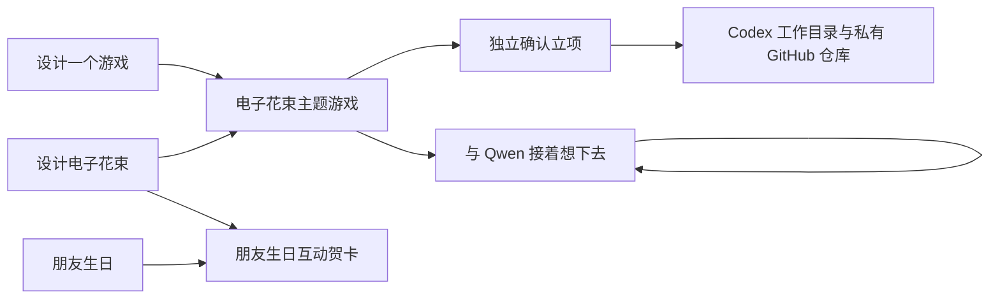

# 灵感气泡库：从碎念到可以动手的项目

状态：已按后续选择实现统一 `/ideas` 想法与时间线、气泡 / 列表、保留来源的融合、本机 Qwen 持续对话、独立确认立项、移除、30 天恢复与永久删除。项目页现已读取真实 Codex 工作目录与 Git 状态，确认立项可创建专属目录、私有 GitHub 仓库和 Codex 工作。使用方式见 [灵感库](ideas.md)、[本机 AI](local-ai.md)、[项目续航](project-resume.md)。下文保留设计背景；拖动、剪贴板/语音、Issue / PR 采集和更深入的 Git 自动操作仍为扩展设想。提示词生成方案已取消，不提供可复制 prompting 工具。

## 核心体验

想到什么先记一小句，成为一颗气泡。大多数气泡可以一直安静地待着；只有自己想进一步探索时才进入融合、发散或项目。不要把每一个念头变成任务，也不要用提醒追着用户把灵感「清零」。

首页只放一个简短的「记下灵感」入口，输入一句话即可保存；链接、图片引用、标签、适用场景都可后来补。语音转录和剪贴板监控不放入首版，避免让快速记录依赖额外服务。

气泡画布保留小院视觉，像纸上轻轻浮起的种子；颜色标识主题，大小只表示用户置顶/聚焦，不代表 AI 打分。默认静止，不漂移躲避点击；交互合并时可以有一次短暂靠拢动画，减少动态模式直接切换。气泡摘要长度受限，完整内容在旁边编辑。

同时提供完整列表视图，支持搜索、标签、状态、最近编辑排序与多选；手机优先列表。键盘选中两个气泡后按「融合」，与拖动操作等价。画布的位置只是一种观看方式，不能成为唯一的组织依据。

## 融合如何保存

「我想设计一个游戏」与「我想设计一个电子花束」融合时，先出现一个小面板：

> 这两个想法怎样发生联系？
> 可先填：把送花变成一个可以玩的互动体验。

保存后创建新的派生气泡「电子花束主题的游戏」，明确显示来自两个原始想法。**原始气泡不删除，也不被改写。** 同一个「电子花束」还可以参与另一种组合，比如与「朋友生日」生成互动贺卡。

每个派生气泡有自己的标题、内容与版本，并记录父气泡 ID 和当时的内容快照。以后修改原始想法不会悄悄改变已融合的想法；界面可以显示「来源后来有更新」。融合不自动把两段文字拼起来冒充新的创意，用户可以改写关系，也可以让 AI 先提出不同组合。

配套操作包括编辑、重命名、标签、置顶、查看来源、再次融合、取消来源关联、撤销本次融合、归档、移除和恢复。撤销融合将派生气泡移入回收站，保留原始气泡；如果它已经派生出新想法或关联项目，先展示影响，不能连带删除。删除父气泡不级联删除子气泡，子气泡保留来源快照并标明原始记录已移除。

## AI 发散是一个可选择的步骤

打开气泡后，在「接着想下去」直接提出问题或继续上一段对话。可以聊受众、感受、意外联系，也可以在需要时讨论最小实验和可行性；不要求先选目的，不强制进入立项模板。融合后的气泡可带上来源快照探索不同可能性。

当前直接调用本机模型 API，不提供提示词生成。参考当前灵感与时间线摘录、选中来源及最近几轮对话；不默认发送整个灵感库、私人文件或其他聊天。完整记录仍保留，对话不覆盖原文；失败保留输入，可取消和重试。

旧版固定三个方向与 MVP 字段的输出已取消。以下只是需要收敛时可讨论的问题，不是每次回复必须填写的模板：

- 面向谁、什么场景、核心体验。
- 与其他方向的差别和主要取舍。
- 一个能验证核心假设的 MVP，以及首版暂不包含什么。
- 必需依赖、未知点、成本/工期的假设范围。
- 验收方法和下一次能开始的一件事。

用户可以持续追问、另开话题、重访会话，并明确删除整段对话或某轮及其后续回复；AI 回复不会自动创建待办或项目。旧版方向草稿保留查看和删除入口。收藏单句与方案版本对比仍是后续设想。

## 电子花束游戏的具体例子

以下是概念草案，不是已验证的市场需求或实现承诺。

| 方向 | 核心玩法 | 最小可验证版本 | 主要取舍 |
| --- | --- | --- | --- |
| 花语拼图 | 通过颜色、形状和花语线索，为某个人拼出一束花 | 三种花、三个短谜题、完成后展开一张祝福卡；本地单页保存进度 | 玩法明确，需先验证谜题是否有趣；不先做大型关卡系统 |
| 一封会开花的信 | 收件人轻触或输入一个回忆，让花束逐步绽放 | 一段可编辑祝福、一次点击互动、最终花束画面 | 情感表达强，但更接近互动礼物；不先做账户、社交和多人协作 |
| 小小花束工坊 | 按顾客简短描述组合花束，获得不同回应 | 一个顾客、三种需求、五种花材和一次结果反馈 | 更适合扩展为游戏；需防止首版就变成经营模拟 |

建议第一个实验选「一封会开花的信」或单关「花语拼图」，先画出 3 个关键画面，做一个可以从头玩到尾的交互。验收不是「用了 AI」「代码写完了」，而是别人无需说明能完成体验，且最终花束能表达预期的祝福。首个行动可以是「写出一位收件人的场景，并画出开始、互动、绽放三屏」。

## 从灵感转成项目

「开始一个项目」位于独立区域。用户填写项目名称、GitHub 仓库名，并核对新建本机目录、私有仓库与 Codex 工作的范围，再确认创建；不要求先让 AI 填完 MVP 表格。

当前立项会将完整灵感、时间线、融合快照、已保存对话与旧草稿交接到专属本机目录，建立私有 GitHub 仓库并启动 Codex。私人上下文留在本机且被 Git 忽略。步骤进度、失败重试、重复创建保护及真实 Git 续航边界见 [项目续航](project-resume.md)。

源气泡保留立项交接记录和 Codex / GitHub 入口，仍可继续讨论与派生其他想法。同一气泡重复确认不会重复创建外部资源；后续修改不会静默覆盖已经交接的上下文。若想做另一种实现，应新建明确的派生想法。

确认前可以返回继续酝酿；确认后不会自动回滚删除已创建的外部资源。网站项目入口可移除、恢复与永久删除，交接记录也可单独清除；这些操作均保留 Codex 项目、本机代码与 GitHub 仓库，并保留必要标识防止重复创建。旧版项目笔记和其显式待办去重能力单独保留。

## 完整生命周期与实施顺序

日常路径是「随手记录 → 暂养 → 可选融合 → 发散 → 小实验 → 确认项目 → 完成归档」。暂养和未立项没有过期时间，不用待办式红色角标制造压力。

| 阶段 | 功能范围 | 必须同时通过的验收 |
| --- | --- | --- |
| 一：可以放心记录和融合 | 快记、列表与画布、搜索、编辑、多选融合、来源关系、归档、回收站恢复 | 10 秒内记下一句话；不拖拽也能融合；取消和恢复不丢原始内容；父气泡变化不改写子气泡；刷新后关系不丢失 |
| 二：可控发散（已实现持续对话） | 本机 Qwen、来源选择、追问、多会话、取消与记录删除；版本对比仍为设想 | 参考范围可见；失败保留输入；对话与用户原文分开；不自动执行或立项 |
| 三：接入项目流程（基础已实现） | 独立立项预览、真实目录 / 仓库 / Codex 交接、失败重试、去重、只读续航与网站记录生命周期 | 同一确认不重复创建；私人上下文不推送；网站删除不动外部项目；更深入的状态与 Issue / PR 联动仍待实施 |

本文件保留早期方案与后续修订。当前能力以文首链接的使用说明为准；尚未实现的拖拽、收藏单句、版本对比和高级项目联动不能因为出现在方案中就视为已提供。
