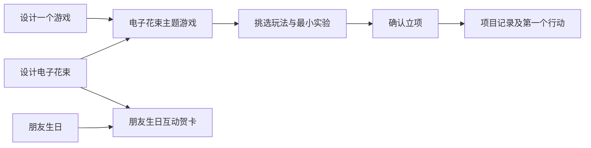

# 灵感气泡库：从碎念到可以动手的项目

状态：第一版已按用户后续选择实施：统一 `/ideas` 想法与时间线、气泡 / 列表、保留来源的融合、本机 Qwen 草稿、确认立项、项目下一步加入既有待办、移除与 30 天恢复。使用方式见 [灵感库](ideas.md)、[本机 AI](local-ai.md)。下文保留设计方向，未列入此清单的拖动、剪贴板/语音、自动 Git 续航等不代表已经实现。提示词生成方案已取消，不提供可复制 prompting 工具。

## 核心体验

想到什么先记一小句，成为一颗气泡。大多数气泡可以一直安静地待着；只有自己想进一步探索时才进入融合、发散或项目。不要把每一个念头变成任务，也不要用提醒追着用户把灵感「清零」。

首页只放一个简短的「记下灵感」入口，输入一句话即可保存；链接、图片引用、标签、适用场景都可后来补。语音转录和剪贴板监控不放入首版，避免让快速记录依赖额外服务。

气泡画布保留小院视觉，像纸上轻轻浮起的种子；颜色标识主题，大小只表示用户置顶/聚焦，不代表 AI 打分。默认静止，不漂移躲避点击；交互合并时可以有一次短暂靠拢动画，减少动态模式直接切换。气泡摘要长度受限，完整内容在旁边编辑。

同时提供完整列表视图，支持搜索、标签、状态、最近编辑排序与多选；手机优先列表。键盘选中两个气泡后按「融合」，与拖动操作等价。画布的位置只是一种观看方式，不能成为唯一的组织依据。

## 融合如何保存

「我想设计一个游戏」与「我想设计一个电子花束」融合时，先出现一个小面板：

> 这两个想法怎样发生联系？
> 可先填：把送花变成一个可以玩的互动体验。

保存后创建新的派生气泡「电子花束主题的游戏」，明确显示来自两个原始想法。**原始气泡不删除，也不被改写。** 同一个「电子花束」还可以参与另一种组合，比如与「朋友生日」生成互动贺卡。

每个派生气泡有自己的标题、内容与版本，并记录父气泡 ID 和当时的内容快照。以后修改原始想法不会悄悄改变已融合的想法；界面可以显示「来源后来有更新」。融合不自动把两段文字拼起来冒充新的创意，用户可以改写关系，也可以让 AI 先提出不同组合。

配套操作包括编辑、重命名、标签、置顶、查看来源、再次融合、取消来源关联、撤销本次融合、归档、移除和恢复。撤销融合将派生气泡移入回收站，保留原始气泡；如果它已经派生出新想法或关联项目，先展示影响，不能连带删除。删除父气泡不级联删除子气泡，子气泡保留来源快照并标明原始记录已移除。

## AI 发散是一个可选择的步骤

打开一个气泡后提供三个目的明确的动作：「找不同方向」「缩成最小实验」「检查可行性」。用户先选想得到什么，再可选填写受众、时间预算、已有技能、希望保留的感觉。缺少信息时列出假设，不伪造需求研究或成功率。

当前首版直接调用本机模型 API，不提供提示词生成。调用前展示会发送的气泡、被选中的父气泡和补充说明；不默认发送整个灵感库、私人笔记、项目文件或历史对话。模型输出单独保存为草稿，不覆盖用户原文；失败保留输入，可取消和重试。

一次发散最多给三个有实质差别的方向，每个方向包含：

- 面向谁、什么场景、核心体验。
- 与其他方向的差别和主要取舍。
- 一个能验证核心假设的 MVP，以及首版暂不包含什么。
- 必需依赖、未知点、成本/工期的假设范围。
- 验收方法和下一次能开始的一件事。

用户可以收藏一句、选中一个方向、改写它，或继续提问；不因为 AI 生成了方案就自动创建待办或项目。不同发散会话保留版本与上下文，支持回到某次草稿，不堆成一条无限聊天记录。

## 电子花束游戏的具体例子

以下是概念草案，不是已验证的市场需求或实现承诺。

| 方向 | 核心玩法 | 最小可验证版本 | 主要取舍 |
| --- | --- | --- | --- |
| 花语拼图 | 通过颜色、形状和花语线索，为某个人拼出一束花 | 三种花、三个短谜题、完成后展开一张祝福卡；本地单页保存进度 | 玩法明确，需先验证谜题是否有趣；不先做大型关卡系统 |
| 一封会开花的信 | 收件人轻触或输入一个回忆，让花束逐步绽放 | 一段可编辑祝福、一次点击互动、最终花束画面 | 情感表达强，但更接近互动礼物；不先做账户、社交和多人协作 |
| 小小花束工坊 | 按顾客简短描述组合花束，获得不同回应 | 一个顾客、三种需求、五种花材和一次结果反馈 | 更适合扩展为游戏；需防止首版就变成经营模拟 |

建议第一个实验选「一封会开花的信」或单关「花语拼图」，先画出 3 个关键画面，做一个可以从头玩到尾的交互。验收不是「用了 AI」「代码写完了」，而是别人无需说明能完成体验，且最终花束能表达预期的祝福。首个行动可以是「写出一位收件人的场景，并画出开始、互动、绽放三屏」。

## 从灵感转成项目

点击「我要做这个」后先打开立项预览：项目标题、一句话目标、选定方向、MVP 范围、验收标准、第一步、关联资料；允许删减 AI 草稿。确认一次才生成项目记录。

项目记录与项目续航一起实现：先保存目标、状态与下一步，再绑定项目目录、Git 快照与交接文件。项目库及目录续航当前尚未实现，立项入口必须等配套的编辑、归档、恢复和待办去重流程具备后再开放。

源气泡与项目双向关联，气泡显示「已立项」，仍可继续浏览和派生其他想法。同一气泡的同一次立项重复点击只打开已存在项目；如果想开另一种实现，先复制为新方向再立项。后续编辑气泡不会自动改项目目标，编辑项目也不会覆盖灵感的原始表达。

撤销立项仅解除关联，并按预览选择是否把本次新建、未被继续编辑的项目记录移入回收站；已有工作内容、磁盘仓库和后续待办不被自动删除。有修改时列出差异，允许保留项目。第一条待办由用户明确加入，以项目 ID 和下一步 ID 去重；重复点击打开已有待办。

## 完整生命周期与实施顺序

日常路径是「随手记录 → 暂养 → 可选融合 → 发散 → 小实验 → 确认项目 → 完成归档」。暂养和未立项没有过期时间，不用待办式红色角标制造压力。

| 阶段 | 功能范围 | 必须同时通过的验收 |
| --- | --- | --- |
| 一：可以放心记录和融合 | 快记、列表与画布、搜索、编辑、多选融合、来源关系、归档、回收站恢复 | 10 秒内记下一句话；不拖拽也能融合；取消和恢复不丢原始内容；父气泡变化不改写子气泡；刷新后关系不丢失 |
| 二：可控发散 | 带上下文的提示词、可编辑方案草稿、版本对比；如另行选择，再接内置模型 | 发送范围可见；失败可恢复；AI 草稿与用户内容分开；只提取选中的方案；不自动执行或立项 |
| 三：接入项目流程 | 立项预览、双向关联、重复点击去重、第一步待办、撤销及冲突处理 | 同一确认只生成一个项目；改气泡不改项目；撤销不丢后续工作；项目完成后仍能追溯最初灵感 |

这次只确定以上行为与边界。等选择首版范围之后再画具体界面和实现，不把气泡拖拽、模型接入和项目续航同时塞进一个首版。
